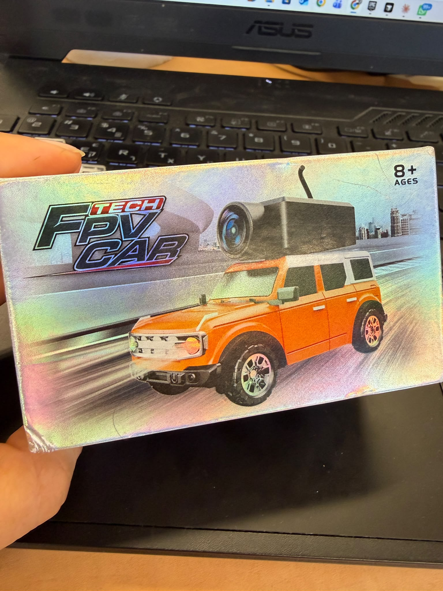
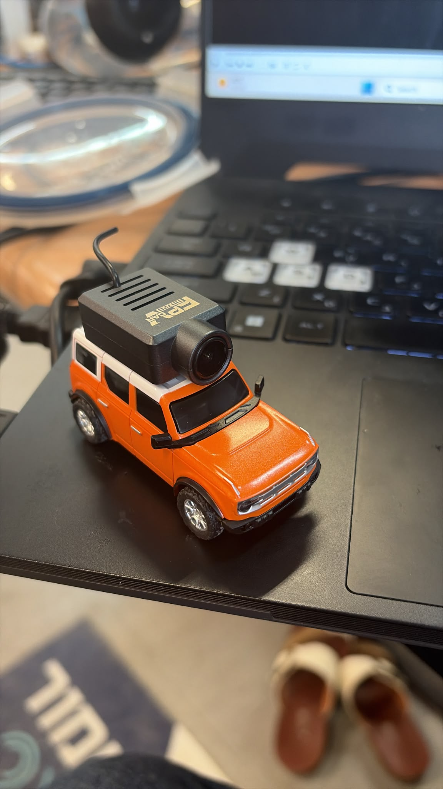

# WiFi FPV Car — Beginner's Guide to Car Control

A small, beginner-friendly starting point for controlling a WiFi/FPV RC car
from Python: connecting over WiFi, reading the live camera feed, and driving
the car with the keyboard. No computer vision or autonomy yet — this repo
section is step one, the foundation everything else (depth estimation,
obstacle detection, mapping) is built on top of.

## The hardware

This was built and tested against a cheap "Tech FPV Car" — a small RC car
with a WiFi camera module mounted on the roof.

**Box:**



**The car:**




The car has its own WiFi module built into the camera unit on the roof. It
either broadcasts its own WiFi network (most common for this kind of toy) or
joins your home network, depending on the model/firmware. Once your computer
and the car are on the same WiFi network, your computer can reach the car
the same way it would reach any other device on a local network — by IP
address.

## Connecting to the car over WiFi

1. **Power on the car.** The camera module on the roof is what hosts the
   WiFi connection and the video stream — it needs to be powered for any of
   this to work.
2. **Join the car's WiFi network from your computer.** Open your computer's
   WiFi settings and look for a network name matching the car/box (often
   something like `FPV-XXXX` or similar — check the box or a QR code/manual
   that came with it). Connect to it like you would any WiFi network
   (it may or may not require a password printed on the box).
3. **Confirm you're on the same network as the car.** Once connected, your
   computer and the car can talk to each other directly, the same way two
   laptops on the same WiFi can ping each other.
4. **Find the car's IP address, control port, and video URL.** These are
   specific to the car's firmware:
   - Check the manufacturer's app or manual first — they sometimes list
     these directly (often under "advanced" or "developer" settings).
   - If not documented, you can find them by watching network traffic with
     a tool like [Wireshark](https://www.wireshark.org/) while driving the
     car from its official phone app — look for outgoing UDP packets (the
     drive commands) and an RTSP connection (the video stream).
   - This project's defaults (in `beginner_car_control.py`) are:
     - IP: `172.16.11.1`
     - Control port: `23458` (UDP)
     - Video URL: `rtsp://172.16.11.1/live/ch00_1`
   - If your car uses a different IP/port, update these three values at the
     top of `beginner_car_control.py`.
5. **Sanity-check the video stream independently.** Before running any
   Python, open the RTSP URL directly in [VLC Media Player](https://www.videolan.org/vlc/)
   (`Media > Open Network Stream`). If you see live video there, your
   network setup is correct and any later connection issues are in the
   Python code, not the WiFi/car itself.

## Running it

```bash
pip install opencv-python
python beginner_car_control.py
```

Click the video window so it has keyboard focus, make sure your keyboard is
set to an English layout, then drive:

| Key | Action |
|---|---|
| `A` / `D` | steer left / right |
| `C` | center the steering |
| `W` | drive forward |
| `S` | drive backward |
| `SPACE` | stop the throttle (steering unchanged) |
| `X` | full stop + re-center steering |
| `P` | save a screenshot of the current camera frame to `assets/` |
| `Q` / `ESC` | quit (also stops the car safely first) |


## How the connection actually works

- **Video** is streamed over RTSP (`cv2.VideoCapture` reads it just like a
  video file).
- **Drive commands** (steering/throttle) are sent as small UDP packets —
  fast, "fire and forget" messages with no delivery guarantee, which is
  fine here because the control loop just keeps re-sending the current
  state ~20 times per second (a "heartbeat"), so one dropped packet never
  matters.
- The exact byte layout of those UDP packets (which byte means "steering",
  which means "throttle", and the checksum byte) is specific to this car's
  firmware and is documented in detail inside `beginner_car_control.py`.

## Where this goes next

This file intentionally stops at manual keyboard driving. The rest of this
repository builds semi-autonomous navigation on top of it:

1. Run a monocular depth-estimation model (Depth Anything V2) on the camera
   feed to estimate what's near vs. far.
2. Turn that into an obstacle/time-to-collision warning.
3. Use that warning to assist or override manual steering.
4. Build a map of where the car has been, so it can find its way home.
